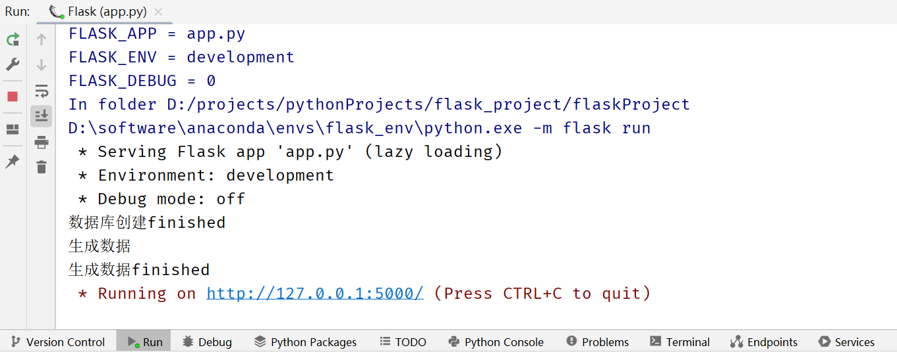

### 1. 项目安装与启动
#### 1.1 基于python3.7.x 项目直接解压，用pycharm打开即可
可自定义虚拟环境，安装requirement.txt中的依赖，等所有所需依赖加载完成，即可启动项目
#### 1.2 项目启动，打开app.py，首次运行请取消下面这段注释

右键Run即可，结果如下：浏览器输入地址即可运行

#### 1.2 项目目录文件结构

##### 1.2.1 blueprint
该文件夹下放置对应模块的请求数据函数
comments.py对应用户评论、hotel.py对应酒店、index对应主页与文件上传、order对应用户购买的景点门票和
酒店订单、sight.py对应景点、station.py对应车站，车次、ticket.py对应车票、user.py对应用户相关请求。
##### 1.2.2 static
该文件夹下的file放置上传的图片文件。
##### 1.2.3 templates
该文件夹下放置html页面
##### 1.2.4 app.py
 项目主文件，挂载相关组件和配置，例如蓝图，跨域组件等等。
##### 1.2.5 data.db
数据库文件，项目使用SQLite数据库，轻便小巧，可自行更换为mysql
##### 1.2.6 extensions.py
项目拓展文件配置，SQLAlchemy数据库ORM管理组件和跨域组件
##### 1.2.7 make_data.py
生成数据库初始数据，方便测试，（可删除）
##### 1.2.8 models.py 
数据库与实体类映射文件，每个类对应数据库的一个表
##### 1.2.9 serviceFunctions.py
项目处理函数，blueprint文件下相应模块的处理函数。
##### 1.2.10 settings.py
项目设置，开发环境，数据库配置，文件上传路径等配置
##### 1.2.11 utils.py
登录拦截器
##### 1.2.12 requirement.txt
项目所需依赖包
